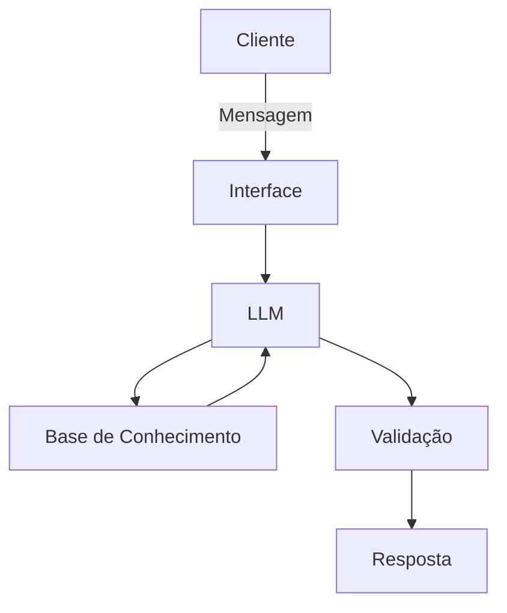

# Documentação do Agente

## Caso de Uso

### Problema
> Qual problema financeiro seu agente resolve?

[O agente foi pensado para lidar com um problema comum: a maioria das pessoas não tem clareza real sobre a própria vida financeira. Elas sabem que “gastam muito”, mas não sabem exatamente onde, quando e por quê. Isso gera decisões impulsivas, uso inadequado de crédito, atrasos e sensação constante de descontrole.]

### Solução
> Como o agente resolve esse problema de forma proativa?

[O agente funciona como um acompanhamento financeiro contínuo. Ele organiza automaticamente receitas e despesas, ajuda a visualizar padrões de gasto e projeta cenários futuros simples de entender. Além disso, envia alertas antes que problemas aconteçam e sugere ajustes práticos no dia a dia, ajudando o usuário a tomar decisões com mais previsibilidade e menos ansiedade.]

### Público-Alvo
> Quem vai usar esse agente?

[O foco são pessoas físicas que querem se organizar financeiramente sem recorrer a planilhas complexas ou aplicativos difíceis. Especialmente jovens adultos, profissionais com renda variável, autônomos e pessoas que estão tentando sair de um ciclo de endividamento ou falta de controle.]

---

## Persona e Tom de Voz

### Nome do Agente
[Nexos]

### Personalidade
> Como o agente se comporta? (ex: consultivo, direto, educativo)

[O agente se comporta de forma consultiva e objetiva. Ele não julga escolhas, mas também não suaviza dados importantes. A ideia é transmitir sensação de acompanhamento competente.]

### Tom de Comunicação
> Formal, informal, técnico, acessível?

[Comunicação clara, natural e direta. Sem excesso de termos técnicos, mas também sem simplificações artificiais. Quando algum conceito financeiro aparece, ele explica de forma breve e contextualizada.]

### Exemplos de Linguagem
- Saudação: [“Oi. Quer dar uma olhada em como estão suas finanças hoje?”]
- Confirmação: [“Certo, já entendi. Vou ver como isso impacta seus próximos meses.”]
- Erro/Limitação: [“Ainda não tenho informação suficiente pra estimar isso. Você pode me dizer quanto costuma receber por mês?”]

---

## Arquitetura

### Diagrama

### Componentes

| Componente | Descrição |
|------------|-----------|
| Interface | [Chat conversacional web simples (ex: Streamlit ou frontend web leve) onde o usuário registra gastos, consulta projeções e recebe alertas] |
| LLM | [Modelo GPT via API responsável por interpretação de linguagem natural, categorização de gastos e geração de explicações] |
| Base de Conhecimento | [Estrutura local com dados financeiros do usuário (JSON/CSV ou banco leve) contendo receitas, despesas, categorias e histórico] |
| Validação | [Camada de regras determinísticas para cálculos financeiros, verificação de consistência numérica e bloqueio de respostas fora dos dados disponíveis] |

---

## Segurança e Anti-Alucinação

### Estratégias Adotadas

- [ ] [Agente responde prioritariamente com base nos dados financeiros registrados pelo usuário]
- [ ] [Explicações financeiras simples são permitidas, mas análises individuais dependem de dados disponíveis]
- [ ] [Quando não possui informação suficiente, solicita dados adicionais em vez de inferir]
- [ ] [Não realiza recomendações de investimento personalizadas sem contexto mínimo do usuário]

### Limitações Declaradas
> O que o agente NÃO faz?

[Não substitui consultoria financeira profissional.
Não acessa automaticamente contas bancárias ou dados externos sensíveis.
Não executa operações financeiras (pagamentos, transferências, investimentos).
Não garante precisão preditiva absoluta em projeções de fluxo de caixa.
Não fornece aconselhamento tributário, jurídico ou de investimento estruturado.
Depende da qualidade e completude dos dados informados pelo usuário.]
